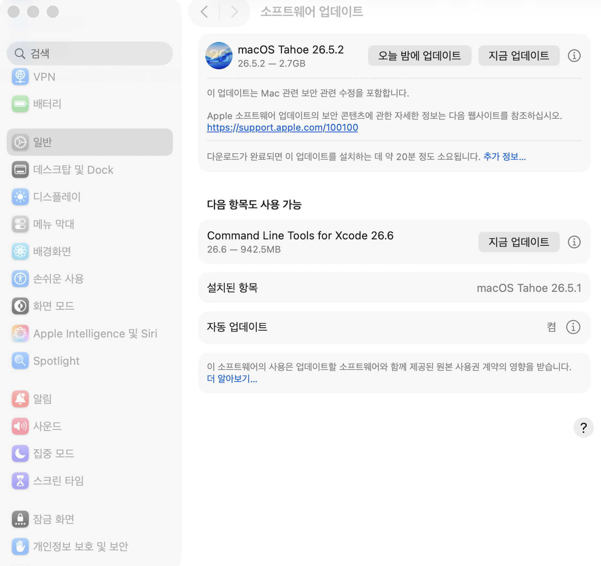
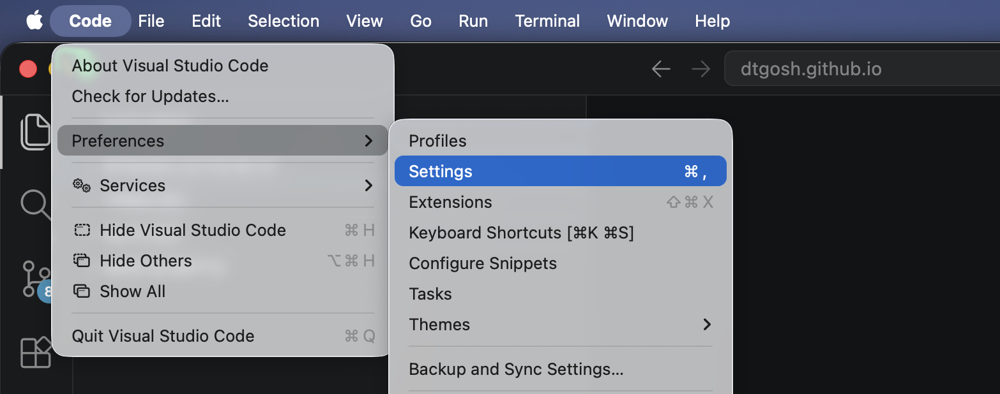
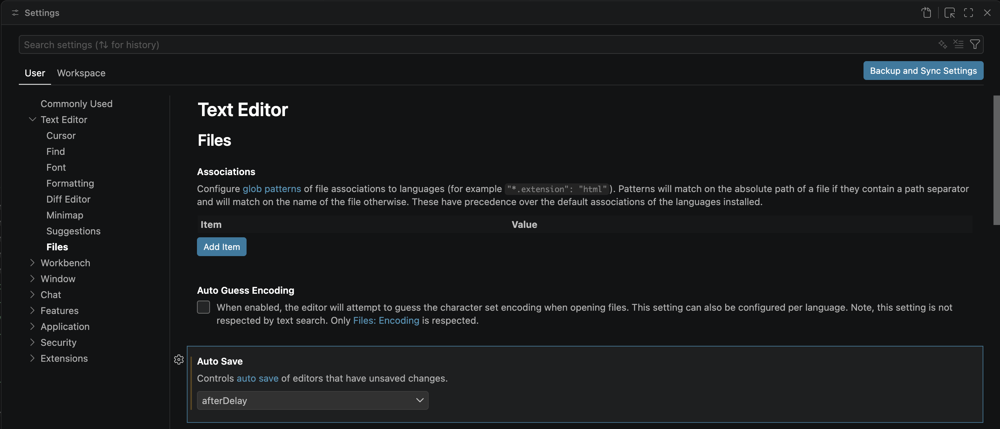
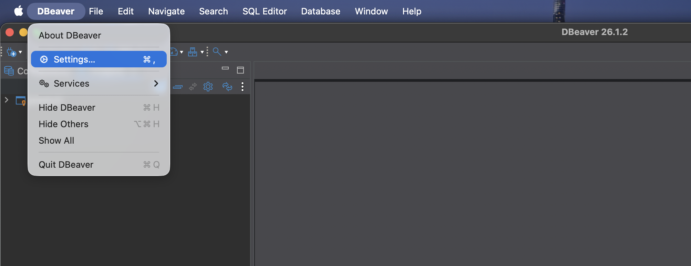
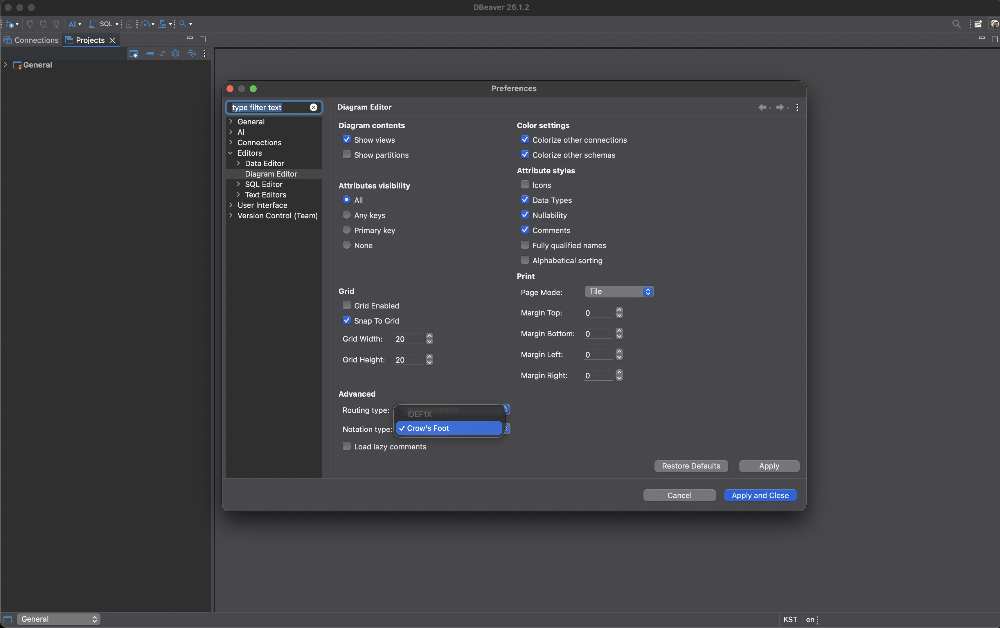
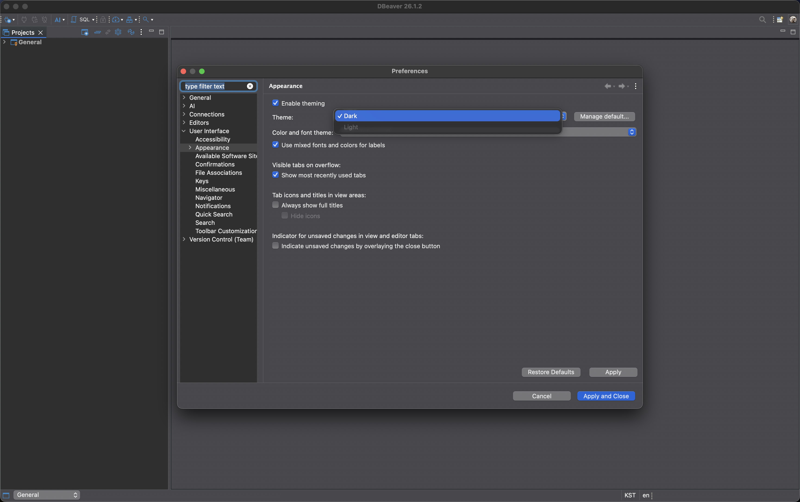

새 컴퓨터를 사시거나 기존 컴퓨터를 초기화하시면, 기존 개발작업을 위해 설정해주었던 부분들을 다시 설정해주셔야 할 것입니다. 이 글에서는 제가 해주던 설정들을 정리했습니다.

<details>
<summary><strong>1. 앱 설치</strong></summary>

---

아래의 앱들을 설치해줍니다. 

- **Chrome**
- **Visual Studio Code**
- **DBeaver Community**
- **Docker Desktop**
- **Command Line Tools for Xcode**
    - 업데이트는 시스템설정에서 확인할 수 있습니다.
        
- **Postman 또는 Bruno 또는 Hoppscotch**
- **nvm 또는 fnm** (Node.js 기반으로 개발이 필요할때 설치)
- **SDKMAN** (Java 기반으로 개발이 필요할때 설치)
- **Pyenv** (Python 기반으로 개발이 필요할때 설치)
- **Homebrew** (필요해지는 순간이 올때 설치)

</details>

<details>
<summary><strong>2. Git 설정</strong></summary>

---

macOS기반의 컴퓨터 사용자이시라면, Git은 Command Line Tools for Xcode에 포함되어 있어서 따로 설치안하셔도 됩니다.

그런데 컴퓨터가 macOS 아니시라면, [https://git-scm.com/install](https://git-scm.com/install)로 가셔서 해당하시는 OS에 맞게 설치하시면 됩니다.

설치가 완료되시면, 아래의 명령어 참고하셔서 유저정보 등록해줍니다.

```bash
# git 유저정보 등록
git config --global user.name "이름"
git config --global user.email "이메일"

# git 유저정보 제거
git config --unset --global user.name
git config --unset --global user.email

# git 유저등록정보 확인
git config --global --list
```

</details>

<details>
<summary><strong>3. Visual Studio Code 설정</strong></summary>

---

Visual Studio Code를 다운로드 받으셨다면, Auto Save 설정을 해주시면 좋습니다. 만약 해당 설정을 안하면 파일을 작성하거나 수정할 때 매번 수동으로 저장해주어야 하는데요. 아래와 같이 하시면 설정할 수 있습니다.

1. 설정 열기

    

2. `User > Files > Auto Save` 경로로 접근해서 `after delay` 설정

    

</details>

<details>
<summary><strong>4. DBeaver Community 설정</strong></summary>

---

DBeaver의 diagram기능은 ERD를 만들어주시 때문에, 데이터 구조를 파악하는데 정말 유용합니다. 그런데 카디널리티 표기법의 기본 설정이 IDEF1X로 되어있는데요. 아래와 같이 하시면 Crow's Foot Notation으로 수정해줄 수 있습니다.

1. 설정 열기

    

2. `Editors > Diagram Editor > Notation type` 경로로 접근해서 `Crow's Foot`으로 수정

    

추가로 아래와 같이 하시면 DBeaver의 전체 테마도 수정해줄 수 있습니다.

1. 설정 열기

    

2. `User Interface > Appearance > Theme`로 접근해서 원하는 테마로 수정

    

</details>
